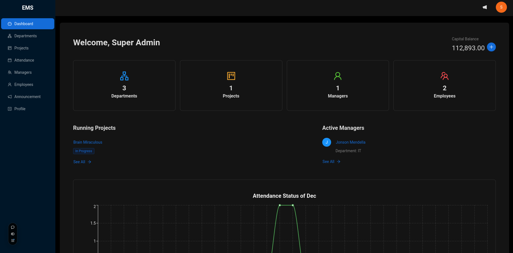

  

# Employee Management System (EMS)  

**Employee Management System (EMS)** is a robust multi-role web application that streamlines employee and project management. It supports **Admin**, **Manager**, and **Employee** roles, each with tailored functionalities to ensure smooth operations within an organization.  

## Purpose  
This project was designed to showcase my ability to implement complex, real-world systems while adhering to **industry-standard practices**, including:  
- **Organized folder structure** for scalability.  
- **Modularized and reusable code** to reduce redundancy.  
- **Clean and readable code** for maintainability and collaboration.  

The EMS platform is ideal for companies looking to automate HR processes, simplify task management, and provide role-specific dashboards for insights and actions.  


---

## 🔗 Live Demo  
Access the live application here: [EMS Live](https://ems.vercel.app/)  

## 📹 Project Demo Video  
Watch the full walkthrough of EMS: [YouTube Demo](https://youtu.be/project_demo_link)  

---

## 🌟 Features  

### Authentication and Onboarding  
- Secure login system for all roles (Admin, Manager, Employee).  
- Automated onboarding process with email notifications, including an **auto-generated employee ID and password** for new employees.  

### Role-Specific Functionalities  

#### Admin Role  
- **Employee & Department Management**:  
  - Onboard new employees.  
  - Manage departments and create projects under them.  
- **Attendance Monitoring**:  
  - Visualize individual attendance records and monthly statistics.  
- **Dashboard & Announcements**:  
  - View system-wide analytics, active managers, and employees.  
  - Post announcements to all employees.  

#### Manager Role  
- **Project Oversight**:  
  - View and manage projects within their department.  
  - Assign tasks to employees under specific projects.  
  - Update project statuses.  
- **Employee Management**:  
  - Access department employee details.  
- **Dashboard**:  
  - Visualize active projects, employee statistics, and personal attendance reports.  

#### Employee Role  
- **Task Management**:  
  - View assigned tasks and update statuses.  
- **Dashboard**:  
  - Get an overview of tasks, manager details, and personal attendance records.  

---

## 🛠️ Technologies Used  

### Frontend  
- **React.js** and **Next.js** for creating a responsive and scalable interface.  
- **Ant Design** for sleek and professional UI components.  
- **TanStack Query** for efficient state management and data fetching.  

### Backend  
- **Node.js** and **Express.js** for a robust API architecture.  
- **MongoDB** with **Mongoose** for a highly scalable database solution.  

### Hosting  
- Fully deployed using **Vercel** for fast and reliable hosting.  

---

## 📂 Implementation Highlights  
- **Organized Folder Structure**:  
  - Separation of concerns for better scalability and maintainability.  
- **Modularized Code**:  
  - Reusable components and services to reduce redundancy.  
- **Clean Coding Practices**:  
  - Followed industry-standard best practices to ensure the codebase is easy to understand and collaborate on.  
- **Comprehensive Role Management**:  
  - Built custom functionalities for Admin, Manager, and Employee roles with a focus on scalability and efficiency.  


## 🚀 How to Get Started  

### Installation  
1. Clone this repository:  
   ```bash  
   git clone https://github.com/yourusername/employee-management-system  
